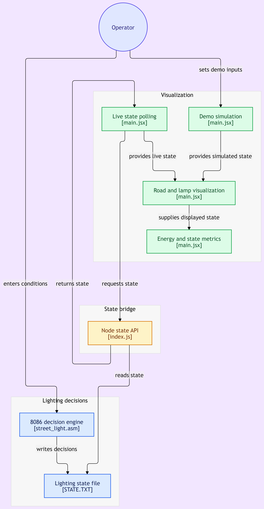
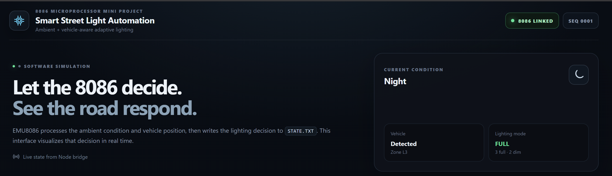
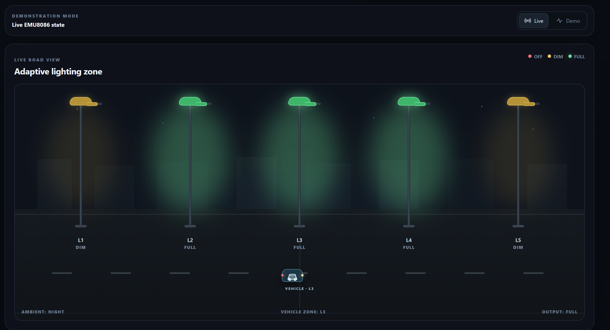
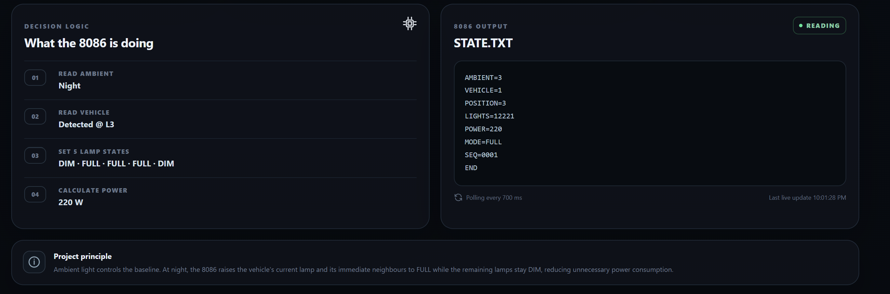

# 8086-Based Ambient + Vehicle-Aware Street Light Automation

Software-only mini-project using **8086 Assembly in EMU8086** with a **React visualization frontend**.

## Architecture

```text
Keyboard input in EMU8086
        ↓
8086 Assembly decision logic
        ↓
STATE.TXT
        ↓
Node.js local bridge
        ↓
React frontend
        ↓
Animated road + vehicle + 5 street lights + energy metrics
```

## Lighting states

- `0` = OFF = 0 W
- `1` = DIM = 20 W
- `2` = FULL = 60 W

### Algorithm

- Day → all OFF
- Dusk → all DIM
- Night + no vehicle → all DIM
- Night + vehicle → current lamp and immediate neighbours FULL; all other lamps DIM

## 1. Run the 8086 program

Open `assembly/street_light.asm` in EMU8086, compile and run it. The program writes `STATE.TXT`.

Example:

```text
AMBIENT=3
VEHICLE=1
POSITION=3
LIGHTS=12221
POWER=220
MODE=FULL
SEQ=0001
END
```

## 2. Configure the bridge

Copy `server/.env.example` to `server/.env` and make sure the path points to the `STATE.TXT` created by your EMU8086 installation.

Typical path:

```text
C:\emu8086\MyBuild\STATE.TXT
```

The Node bridge loads this `.env` file automatically.

## 3. Start the bridge

From `server`:

```bash
node index.js
```

Expected output:

```text
8086 bridge listening on http://localhost:5178
Watching: C:\emu8086\MyBuild\STATE.TXT
```

## 4. Start the frontend

From `frontend`:

```bash
npm install
npm run dev
```

Open the Vite URL shown by the terminal.

### Live mode

The frontend polls the bridge and visualizes the latest real `STATE.TXT`.

### Demo mode

The frontend can simulate Day/Dusk/Night, vehicle presence, and vehicle position without EMU8086. This is useful for screenshots or presentation practice.

## Demonstration cases

### Day

```text
Ambient: 1
Vehicle: 0
```

Result:

```text
LIGHTS=00000
POWER=000
MODE=OFF
```

### Dusk

```text
Ambient: 2
Vehicle: 0
```

Result:

```text
LIGHTS=11111
POWER=100
MODE=DIM
```

### Night + no vehicle

```text
Ambient: 3
Vehicle: 0
```

Result:

```text
LIGHTS=11111
POWER=100
MODE=DIM
```

### Night + vehicle at L3

```text
Ambient: 3
Vehicle: 1
Position: 3
```

Result:

```text
LIGHTS=12221
POWER=220
MODE=FULL
```

## Screenshots & Diagrams

### 1. System Architecture & State Flow Diagram
Complete data flow from EMU8086 assembly decision logic through `STATE.TXT` to the Node.js bridge and React visualization interface.



### 2. Live Status & Environmental Monitoring
Live overview displaying active EMU8086 link status, ambient condition detection, and vehicle presence indicators.



### 3. Road View & Adaptive Lighting Visualization
Visual road representation showing dynamic lamp dimming and bright zone activation around a detected vehicle at lamp L3.



### 4. 8086 Decision Logic & State Parser
Detailed step-by-step logic breakdown, real-time `STATE.TXT` output polling, and calculated power consumption.



## Important project rule

The **8086 Assembly program is the decision engine**. The React application only visualizes the state written by the 8086. Demo mode is explicitly local UI simulation and is not presented as 8086 output.
